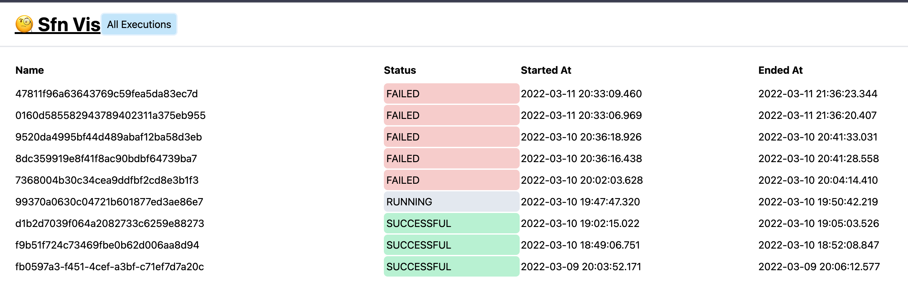
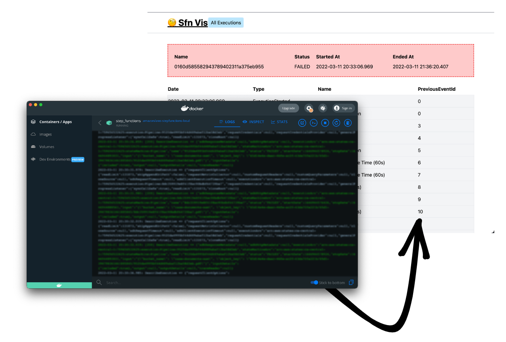

# SFN-Vis

# How SFN-Vis works

SFN-Vis parses the output of your AWS Step Functions docker container (that runs locally, for testing) and indexes it then serves it along with a frontend for viewing the log streams.

# Docker required

Right now you need to be running SFN-Vis in docker so it can print the logs. There's no other way to get logs from the local Step Functions runner, unless we do something with a Log4J backend.

> This is a bad idea: If we can get a Log4Shell explot to occur we could exec some code to forward logs to this visualizer

# How to run

1.  Build the react app `yarn build`
2.  Build the app `cargo build --release`
3.  Move the binary `mv ./target/release/sfn-vis /usr/local/bin/`
4.  Run the app `sfn-vis [YOUR CONTAINER ID / NAME]`
